# Diego Alejandro Bautista - Prueba Técnica

## Descripción
Prueba técnica, elaboración de una API REST en un contexto de aprendizaje virtual.

Contiene:
- Tutorial de un tema en específico (descripción, título, estado de publicación (visible/oculto)).
- Detalles del tutorial (Fecha en que se creó y quién lo creó). 

Funcionalidades: 
- Registrar los tutoriales. (CREATE)
- Listar los tutoriales, el detalle asociado al tutorial. (READ)
- Modificación de un tutorial y su detalle. (UPDATE)
- Eliminación de un tutorial y su detalle. (DELETE)

Observaciones: 
- Un tutorial tiene únicamente un detalle de tutorial.


# Instrucciones de instalación
1. Clonar el repositorio de GitHub proporcionado:
    Abrir una terminal en su máquina y navegar al directorio donde desea clonar el repositorio. Luego, ejecutar el siguiente comando para clonar el repositorio de GitHub (Es necesario el uso de git):
    > ```git clone https://github.com/diegobauto/aprendizaje_virtual.git```

    Luego ingresar a la carpeta que se creó al clonar el repositorio.
    > ```cd aprendizaje_virtual/```

2. Instalar dependencias del Servidor (Express.js):
    Navegar al directorio del servidor (donde generalmente se encuentra un archivo package.json) utilizando el siguiente comando:
    > ```cd server/```

    Luego, instalar las dependencias del servidor con npm:
    > ```npm install```

3. Configurar la base de datos local:
    Asegurarse de que se tiene una base de datos local configurada y ejecutándose (Base de datos con MySQL). 
    Asegurarse de que la configuración de la base de datos en el servidor coincida con la configuración local.

    - La configuración local se encuentra en el directorio: 
        > ```server/database/db.js```

    - Las consultas SQL para la generación de la base de datos se encuentran en el directorio:
        > ```server/database/db.sql```

4. Ejecutar el servidor (Express):
    Una vez que las dependencias del servidor están instaladas y la base de datos está configurada, puedes ejecutar el servidor con el siguiente comando:
    > ```npm run dev```

    El servidor Express debería estar ahora en funcionamiento y escuchando en un puerto determinado.

5. Instalar dependencias del cliente (React):
    Abrir una nueva terminal, ingresar nuevamente a la carpeta clonada (Paso 1) y navegar al directorio del cliente (donde generalmente se encuentra un archivo package.json) utilizando el siguiente comando:
    > ```cd client/```

    Luego, instalar las dependencias del cliente con npm:
    > ```npm install```

6. Iniciar la aplicación de React:
    Una vez que las dependencias del cliente estén instaladas, iniciar la aplicación de React con el siguiente comando:
    > ```npm run dev```
    
    Esto iniciará la aplicación React en un servidor de desarrollo.

7. Ahora debería estar ejecutandose la aplicación Express.js y React, funcionando en su maquina. Asegurarse de que los puertos y rutas en la configuración coincidan con lo que se espera en el proyecto (principalmente en la gestión de la base de datos). 
Para acceder a la aplicación a través del navegador es necesario visitar la dirección proporcionada por el servidor de desarrollo de React (generalmente http://localhost:5173).


## Stack Tecnológico
- Servidor: Express
- Cliente: React
- Base de datos: MySQL
- XAMPP


## Estructura empleada
- Directorio server/ (API):
    - controllers/: Funciones controladoras para manejar las solicitudes HTTP.
    - database/: Archivos relacionados con la configuración y la interacción con la base de datos.
    - middlewares: Funciones intermedias que se ejecutan antes o después de las rutas principales de la aplicación.
    - routes/: Archivo con la definición de las diferentes rutas de la api.
- Directorio client/src:
    - api/: Majeno de solicitudes con axios hacia la api.
    - components/: Contiene los componentes usados en la aplicación.
    - context/: Contexto general de la aplicación para el uso de los tutoriales, uso del CRUD.
    - pages/: Páginas o pantallas individuales de la aplicación.


## Modelo de datos
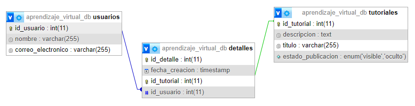


# Evidencias

### API REST
Creación de un tutorial:
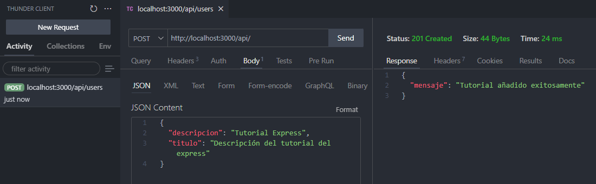

Aunque en la base de datos el *"id_tutorial"* sea único en la tabla **"detalles"**, esto se valida de igual manera en el código antes de registrar correctamente un tutorial. 

Se altera el código para evidenciar que "un tutorial tenga únicamente un detalle de tutorial":

Respuesta del servidor: 


Respuesta de la base de datos: 
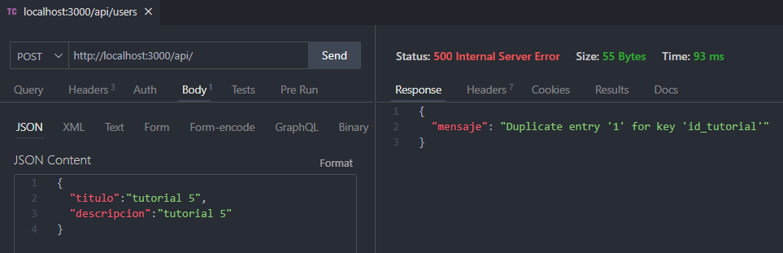

Obtener un único tutorial con su detalle:
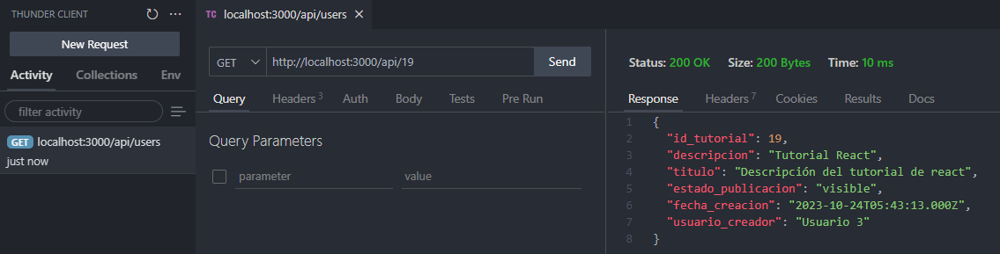

Obtener la lista de los tutoriales con su detalle:
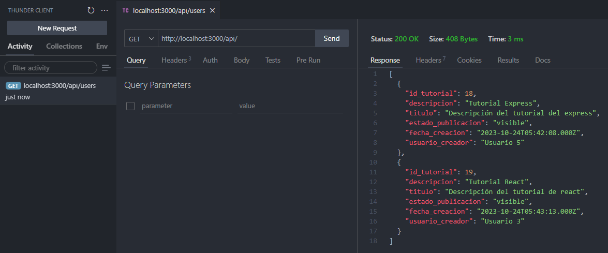

Actualización de un tutorial:
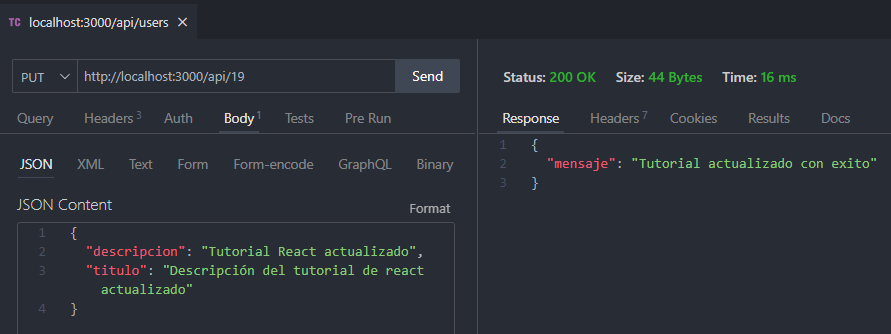

Comprobación de la actualización anterior:
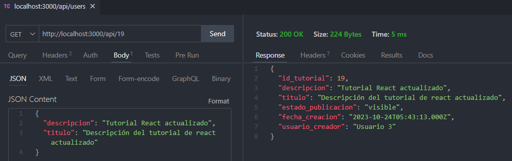

Actualización de un tutorial (modificando tambien el estado de la públicación):
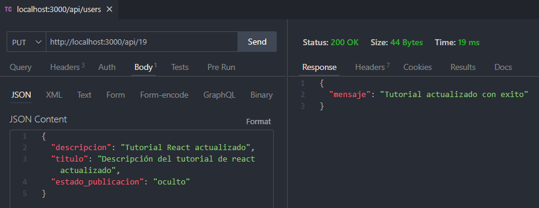

Comprobación de la actualización anterior:
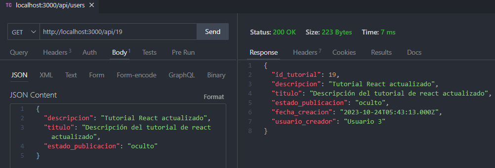

Actualización de un tutorial (modificando únicamente el estado de la públicación):
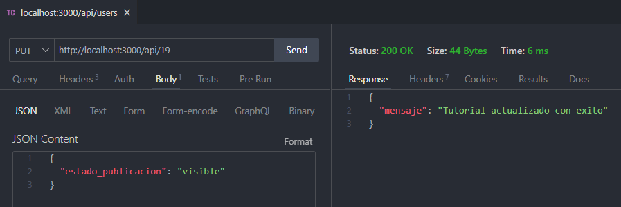

Comprobación de la actualización anterior:
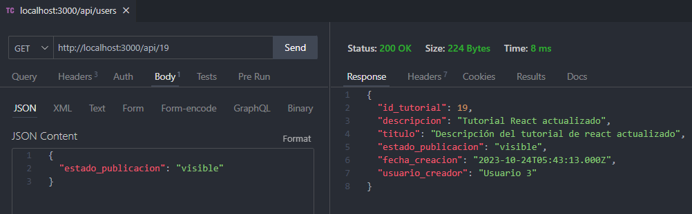

Eliminación de un tutorial:
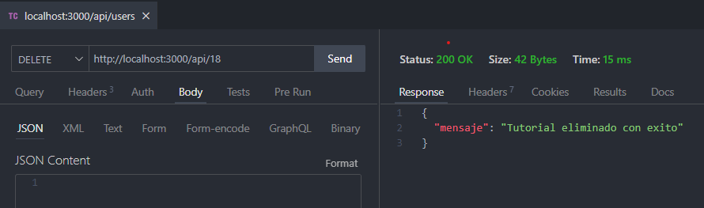

Comprobación de la eliminación de un tutorial:
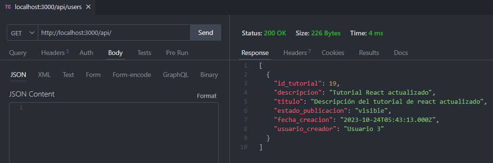

### REACT
En la aplicación, se visualiza la siguiente pantalla cuando no hay tutoriales en la base de datos:
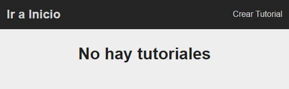

En la parte superior derecha aparace la opción de "Crear Tutorial", al presionarlo aparecerá un formulario para la creación de un nuevo tutorial:

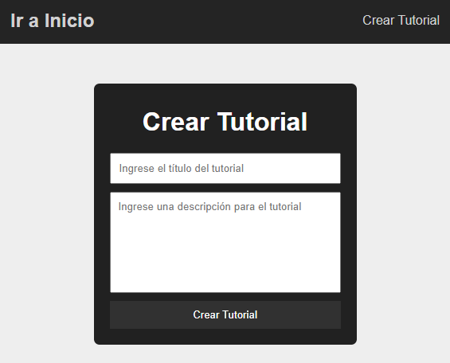

Se ingresan los datos de acuerdo al titulo y descripción del tutorial:
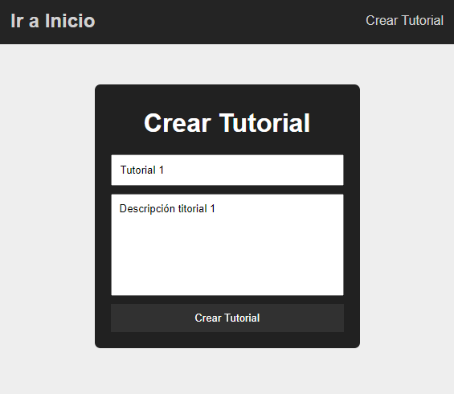

Al presionar el botón "Crear Tutorial" del formulario nos redirige a la páguna principal donde se evidencia la creación del tutorial:

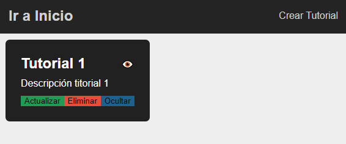

Como los tutoriales manejan un estado de públicación (Visible/Oculto), aparece un botón (Mostrar/Ocultar) que nos permite alternar ese estado:

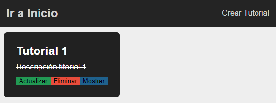

En cada tutorial aparece tambien un botón "Actualizar" el cual nos redirige al un formulario, en donde aparecerán los valores ya registrados del tutorial:

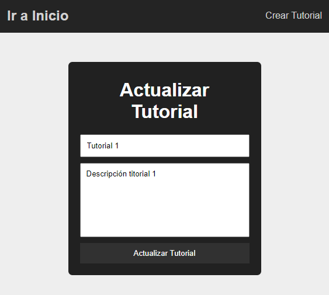

Los datos del tutorial se pueden modificar:
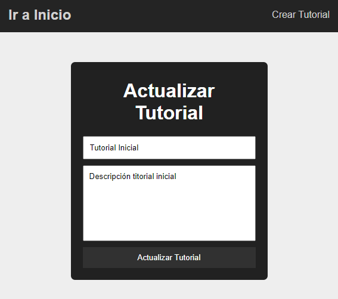

Al presionar el botón de "Actualizar Tutorial" del formulario nos redirige a la página principal en donde se puede evidenciar que el tutorial se actualiza correctamente:
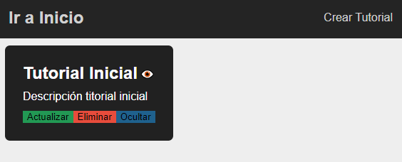

Se pueden añadir la cantidad de tutoriales necesarios, y al presionar el botón "Eliminar", el tutorial será eliminado:
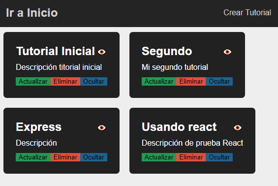

### Base de Datos
Visualización de la base de datos y sus respectivas tablas:

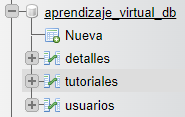

Inicialmente se dispone de una tabla vacía para los **"tutoriales"**:

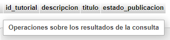

Inicialmente se dispone de una tabla vacía para los **"detalles"** de los tutoriales:
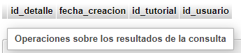

Inicialmente se dispone de un registro previo de diferentes usuarios para la simulación con respecto al usuario quien creo el tutorial, tabla **"usuarios"**:

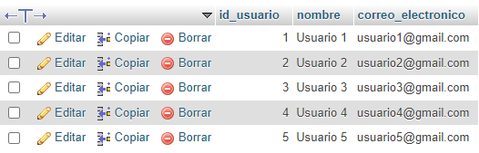

Validación al insertar datos en nuestra tabla **"tutoriales"**
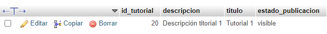

Como al crear un tutorial es necesario tener el detalle con la fecha de creación y el usuario quien creo el tutorial, se valida de igual manera que se hayan insertado los datos correctamene en la tabla **"detalles"**:
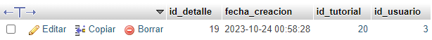

Validar la actualización, principalmente para el estado de públicación del tutorial, tabla **"tutoriales"**:
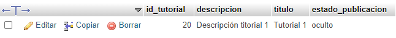

Validar la actualización con respecto al titulo o descripción del tutorial, tabla **"tutoriales"**:
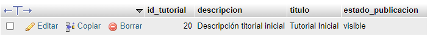

Evidencia de varios datos (tutoriales) registrados:
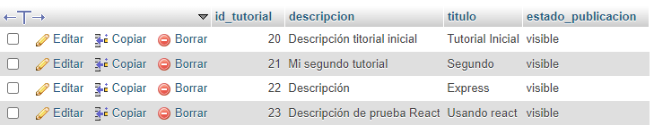
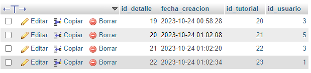

De igual manera al eliminar un tutorial, tanto el tutorial como el detalle serán eliminados. (No se evidencia debido a que no se visualiza claramente cuando se esta eliminando el tutorial). Las únicas formas son: por medio de un video u obteniendo nuevamente la lista de todos los tutoriales (visualizar tablas).

### XAMPP
Xampp permite gestionar la base de datos MySQL, se evidencia el uso del puerto 3306 para la base de datos:
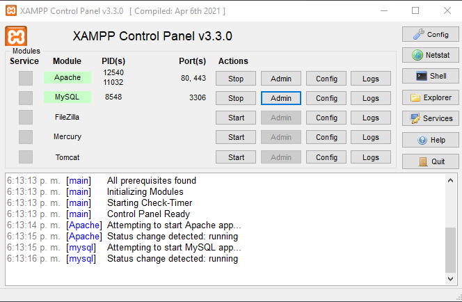

### Cliente - servidor
Evidencias del cliente y servidor ejecuntandose:

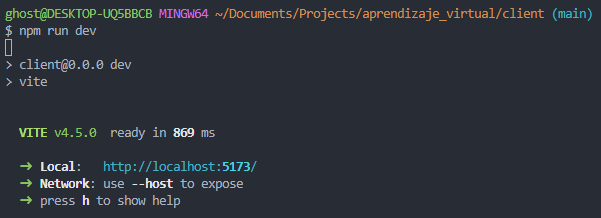
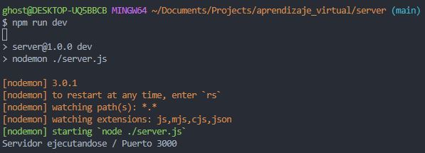